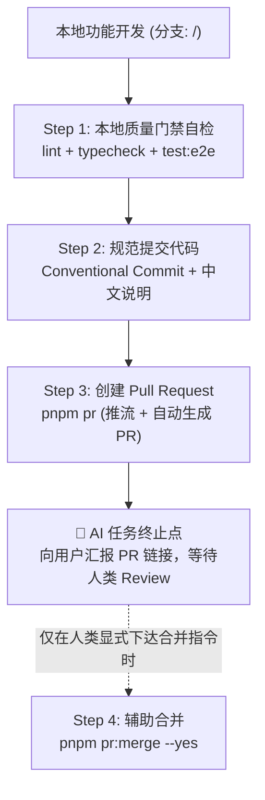

# AI CI/CD 与 PR 标准作业程序 (AI SOP)

> 本文档专为协同编程 AI Agent 与开发者编写。定义了本仓库在代码提交、验证、创建 PR、合并与发版过程中的**硬性规范、权限边界与标准化步骤**。

---

## 🚨 0. AI 行为红线与权限边界 (Safety Guardrails)

协同编程 AI 在本仓库执行任何 Git 与 CI/CD 操作时，必须无条件遵守以下安全红线：

1. **“提 PR / 走 PR 流程”严格终止于创建 PR**：
   - 当用户发出“提 PR”、“提交代码并建 PR”、“走 PR 流程”等指令时，AI 的任务**严格终止于成功执行 `pnpm pr` 并向用户提供 PR 网页链接**。
   - 🛑 **严禁擅自执行 `pnpm pr:merge`**！合并主分支属于不可逆生产环境变更，决策权完全属于人类。
2. **合并命令的唯一触发前提**：
   - 只有当用户在对话中发出**显式、单独的合并指令**（例如：“确认合并”、“帮我把 PR 合并了”）时，AI 才可以协助执行 `pnpm pr:merge --yes`。
   - `scripts/pr.ts` 已内置非交互终端防护机制：非交互式环境（无 TTY）且未传 `--yes` 时将直接阻断退出。
3. **严禁擅自发版**：
   - 严禁自主执行 `pnpm release:*` 或向远端推送 release tag。发版必须由人类明确下达指令。
4. **禁止直推主干**：
   - `main` 分支受分支保护锁定（仅允许 squash merge），禁止任何形式的 `git push origin main` 或 bypass 尝试。

---

## 📋 1. AI 标准工作流 SOP (Step-by-Step)



### Step 1: 本地门禁自检 (必须全部通过)
提交代码前，必须确保本地检查无任何报错：
```bash
pnpm lint        # Biome 规范与代码格式扫描
pnpm typecheck   # TypeScript 全工作区类型检查
pnpm test:e2e    # Playwright + Electron 完整端到端测试
```

### Step 2: 分支管理与规范提交
1. **分支命名规范**：从 `main` 切出，格式为 `<type>/<topic>`（例如 `feat/wco-titlebar`、`fix/tray-flake`）。
2. **提交信息规范**（由 commitlint 校验）：
   - 格式：`<type>(<scope>): <中文说明>`
   - `type` 枚举：`feat` | `fix` | `docs` | `style` | `refactor` | `perf` | `test` | `build` | `ci` | `chore` | `revert`
   - 说明示例：`feat(tray): 增加托盘右键退出菜单`
   - 规则要求：说明部分**必须包含简体中文**，且单行不超过 100 字符。

### Step 3: 创建 Pull Request (AI 终止点 🛑)
运行一键提 PR 命令：
```bash
pnpm pr
```
- **该命令行为**：前置状态校验 ➔ 自动推送到远端 ➔ 提取首个提交标题作为 PR 标题 ➔ 按照模板填充正文并创建 GitHub PR。
- **AI 动作要求**：命令执行完成后，**立即停步**。将生成的 PR 网页链接（形如 `https://github.com/.../pull/xx`）回复给用户，提醒用户进行审查。**严禁继续执行合并命令！**

### Step 4: 合并 PR (仅当人类显式授权时)
只有在用户明确确认并下达合并指令后，方可协助执行：
```bash
pnpm pr:status          # 查看当前 PR 的门禁状态
pnpm pr:merge --yes     # 等待 CI 门禁全绿后自动 squash 合并，并自动清理远端与本地分支
```

---

## 🛠️ 2. 命令与权限矩阵 (Command & Permissions)

| 命令 | 作用 | AI 权限级别 | 触发前提 |
| :--- | :--- | :--- | :--- |
| `pnpm lint` / `typecheck` | 本地质量自检 | ✅ **自主允许** | 随时自检 |
| `pnpm test:e2e` | 端到端自动化测试 | ✅ **自主允许** | 提交代码前必须验证 |
| `git commit` | 规范提交代码 | ✅ **自主允许** | 需符合 commitlint 规范 |
| `pnpm pr` | 推送分支并创建 PR | ✅ **自主允许** | 收到用户提 PR / 走 PR 流程意图 |
| `pnpm pr:status` | 查看 PR 与门禁状态 | ✅ **自主允许** | 随时查询状态 |
| `pnpm pr:merge` | 合并 PR 到 main 分支 | ⛔ **严格受限** | **必须有用户显式下达的合并指令** |
| `pnpm release:*` | 版本升级与打 tag | ⛔ **严格受限** | **必须有用户显式下达的发版指令** |

---

## 🔒 3. CI 门禁体系说明

GitHub Actions 流水线（`.github/workflows/ci.yml`）：
- **`typecheck`**（**Required**）：TypeScript 全局类型检查。
- **`lint`**（**Required**）：Biome 格式与规则扫描。
- **`e2e`**（**Required**）：Playwright + Electron 完整回归测试。
- *CodeQL* 与 *OpenCodeReview*（信息性）：安全漏洞与 AI 增量代码审查。新开 PR 自动审查；后续提交可在 PR 评论回复 `/review` 手动触发增量复查，不阻塞合入。
