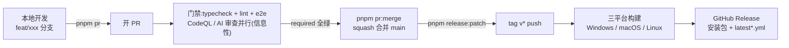

# CI/CD 与开发流程指南

本目录的自动化体系总览,以及从写代码到发版的完整操作路径。
原则:命令可直接照抄;`> 决策:` 注脚解释为什么,不感兴趣可跳过。

## 本地环境

- **Node.js 22**(用 fnm / nvm 安装均可),pnpm 不单独安装
- **GitHub CLI**(下文 `pnpm pr` 三命令的依赖):`winget install GitHub.cli`,随后一次性认证 `gh auth login`
- 首次初始化:

```bash
corepack enable        # 启用 Node 自带的包管理器调度器
pnpm install           # pnpm 版本由根 package.json 的 packageManager 字段决定
```

常用命令:

| 命令 | 用途 |
|---|---|
| `pnpm start` | 启动开发模式 |
| `pnpm lint` / `pnpm typecheck` | 提交前自查(biome / tsc) |
| `pnpm run test:e2e:build` | 构建产物 + 跑 e2e(= build + test:e2e) |
| `pnpm pr` / `pr:merge` / `pr:status` | PR 工作流:开 PR / 合并 / 状态(见下文) |
| `pnpm release:patch\|minor\|major` | 发版(见下文) |

> 决策:pnpm 交给 corepack 管理,版本单点在 `packageManager` 字段,CI 与本地天然一致。

## 分支规范

从 `main` 切出,命名 `<type>/<topic>`,type 与 commitlint 枚举一致:

```text
feat/wco-titlebar
fix/tray-flake
refactor/component-folders
docs/ci-guide
```

> 决策:分支名与 conventional type 对齐,开 PR 起标题时认知零成本,分支列表按类型可扫读。

## 提交与 PR

1. 提交信息走 conventional commits,commit-msg 钩子(commitlint)校验:类型合法、说明含中文、body 每行 ≤100 字符。
2. 开 PR 一条命令(前置检查 → push → 创建):
   ```bash
   pnpm pr
   ```
   - **标题自动取分支上第一个提交的 subject**,即未来 main 上的提交信息,请保持 `type(scope): 中文说明` 格式——squash 合并后标题即提交信息,changelog 从这里来。此格式无机器校验,靠自觉(本地 commit 有 commitlint 把关,PR 标题没有),写歪会降低 changelog 质量;
   - 正文由模板预填(意图 / 改动 / 人工验证),只填 CI 查不了的事;
   - 分支已有 PR 时命令会拒绝并提示:直接 push 即可更新该 PR。
3. draft PR 可放心使用:转正式(ready_for_review)同样会触发全部检查。

## 门禁一览

| 检查 | 性质 | 内容 |
|---|---|---|
| `typecheck` | **required** | tsc 全工作区类型检查 |
| `lint` | **required** | biome 检查 |
| `e2e` | **required** | Playwright + Electron,单 worker 串行 |
| CodeQL | 信息性 | 安全数据流扫描,结果在 Security 标签页 |
| OpenCodeReview | 信息性 | AI 行内审查,评论在 PR 上 |

> 决策:required 只圈确定性检查;AI 审查与扫描存在假阳性,只做信号、不挡合并。
> 决策:e2e 单平台 Ubuntu(Linux 计费系数 1x 最低,helper 已带 `--no-sandbox`);Windows/macOS 差异由发版的三平台构建暴露。

## 合并

- 仓库设置只允许 **squash merge**,且 Default commit message = PR title;
- 分支保护强制上述三个 required check 全绿才能合入 `main`,**没有豁免**(hotfix 也不例外),直接 push `main` 同样被拒(ADR-0004);
- 一条命令完成"等门禁全绿 → squash → 删远端分支":
  ```bash
  pnpm pr:merge
  ```
- 当前仓库 PR 与 checks 概览:`pnpm pr:status`;
- 合并后的分支清理(不删会越积越脏;删分支不影响 PR 页面存档):
  ```bash
  # 分支在当前工作树:切回 main 拉取后删除
  git checkout main && git pull && git branch -d feat/xxx
  # 分支挂在独立 worktree:
  git worktree remove <worktree路径> && git branch -d feat/xxx
  ```
- 一个大分支要拆多个 PR:把相关 commit `cherry-pick` 到干净分支分别开 PR;存在依赖时用 stacked PR(`gh pr create --base <前一个PR的分支>`),前者合并后 `gh pr edit --base main` 收窄 diff。

## 发版

版本"只进不发"——何时发、发什么级别由人决定,其余全自动:

```bash
pnpm release:patch    # 或 minor / major
```

changelogen 会依次:升 `package.json` 版本 → 生成 CHANGELOG → 提交 → 打 `vX.Y.Z` tag → 推送。
tag 的 push 自动触发 **Release App** workflow:三平台(Windows/macOS/Linux)构建 → 发布 GitHub Release(安装包 + `latest*.yml` 自动更新元数据 + 自动 release notes)。

> 决策:tag 驱动、CI 内不升版本——版本与 tag 的一致性由 changelogen 的发版提交保证。
> 手动在 Actions 页 dispatch 只构建不发布,用于验证构建管线。

## hotfix

`main` 出现需要紧急修复的问题时:从 `main` 切 `fix/xxx` → 修复 → **走完全相同的 PR 门禁**(紧急不是跳过 e2e 的理由,它就是为这种时刻存在的)→ 合并 → 需要出包时 `pnpm release:patch`。

## 发版 troubleshooting

- **`tag already exists`**:该版本号已发布过。换下一级版本号;确要重发,先在 Releases 页删 Release、`git push origin :refs/tags/vX.Y.Z` 删远端 tag,再重新发版。
- **Release App 构建失败**:先判断是否瞬态(网络/runner 抖动)——是则在 Actions 页 re-run;平台专属问题(Linux 系统依赖、mac 签名)需修代码,重新发版打新 tag。
- **发错版本**:删除 Release 和 tag 后打新版本号;注意已安装用户通过 `latest*.yml` 只会向更高版本更新,撤回的旧版本"追不回来",宁可发 patch 覆盖。

## issue 关联

PR 的"意图"一节引用 `#编号`;修复类 PR 在正文写 `fixes #n` 可在合并时自动关闭对应 issue。

## 全流程图



## 文件地图

| 文件 | 职责 |
|---|---|
| `workflows/ci.yml` | PR / main 门禁:typecheck + lint + e2e |
| `workflows/release.yml` | tag 触发的三平台构建与发布 |
| `workflows/codeql.yml` | 安全扫描(push/PR main + 每周三定时) |
| `workflows/open-code-review.yml` | AI 代码审查 |
| `actions/setup-env/` | 构建环境准备:corepack/pnpm、Node 22、Xvfb |
| `../scripts/pr.ts` | PR 命令封装:pnpm pr / pr:merge / pr:status |
| `ISSUE_TEMPLATE/` 目录 + `PULL_REQUEST_TEMPLATE.md` | 中英双语模板(issue 多模板用目录;PR 单模板须单文件才会自动预填正文) |

## 设计决策速览

- tag 驱动发版,CI 内不升版本;
- squash only,PR 标题 = main 提交信息,changelog 按 feature 粒度;feature 一律经 PR,分支保护锁死(required checks + 仅 squash + 拒绝直推),命令入口 `pnpm pr` 三件套(ADR-0004);
- e2e 单平台进门禁,三平台构建留给发版;
- dependabot 已移除,action 版本手动升级;
- pnpm 由 corepack 管理,版本单点在 `packageManager` 字段。
