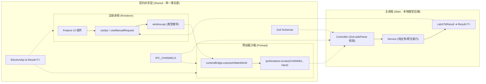

# Electron React Monorepo Template

> 基于 **Electron 41 + Vite 8 + React 19 + ContextBridge (Typed IPC) + LinguiJS (中文优先 i18n) + TailwindCSS + Playwright + Biome** 构建的现代化、高性能、安全类型友好的桌面应用 Monorepo 模板。

---

## 🗺️ 架构导航与文档索引 (Architecture Hub)

本项目严格采用技术分层与自包含领域划分，根目录作为全景导航入口，各子包职责与独立文档规范索引如下：

| 模块 / 子包 / 文档 | 物理路径 | 核心职责 | 详细指南 |
| :--- | :--- | :--- | :--- |
| **`@app/shared`** | [`packages/shared/`](packages/shared) | **跨端契约单一事实源**：统一管理 Zod 运行时 Schema、IPC Channel 常量、纯 TypeScript 返回接口与 `Result<T>` 契约模型（无桶文件直出） | [Shared 架构指南](packages/shared/README.md) |
| **`@app/main`** | [`packages/main/`](packages/main) | **本地微型后端**：基于 ModuleRunner 流水线管理窗口与系统生命周期，采用 `Controller ➔ Service` 严格分层处理 IPC 请求与原生系统交互 | [Main 架构指南](packages/main/README.md) |
| **`@app/preload`** | [`packages/preload/`](packages/preload) | **安全隔离桥接**：在 Context Isolation 沙箱保护下，将强类型的 `apiBridge` 通过 `contextBridge` 安全暴露为 `window.api` | [Preload 架构指南](packages/preload/README.md) |
| **`@app/renderer`** | [`packages/renderer/`](packages/renderer) | **现代前端界面**：React 19 + TailwindCSS + antd + LinguiJS，采用自包含 Feature 驱动架构，统一通过 `useIpc` 消费数据 | [Renderer 架构指南](packages/renderer/README.md) |
| **🌐 多语言架构** | [`docs/i18n/`](docs/i18n) | **中文优先现代国际化**：LinguiJS 6、Source-as-Key 理念、Vite 8 AST 宏优化、按需独立 Chunk 拆分与跨进程原生托盘联动 | [i18n 架构指南](docs/i18n/architecture.md) · [实操 SOP](docs/i18n/guide.md) |
| **🧪 E2E 自动化测试** | [`e2e/`](e2e) | **端到端质量防护**：基于 Playwright 驱动真实打包/运行态 Electron 进程，常态化保障主题、多语言、托盘及防冲刷逻辑 | [测试用例集](e2e/settings.spec.ts) |
| **📜 日志与防护** | [`docs/logging-and-exception-audit.md`](docs/logging-and-exception-audit.md) | **系统容灾与调试**：进程隔离落盘、5MB 自动轮转、大 Payload 截断保护与未捕获异常分级处置指南 | [日志系统指南](docs/logging-and-exception-audit.md) |
| **工程质量规范** | [`CONTRIBUTING.md`](CONTRIBUTING.md) | **研发与提交守则**：全库 Biome 静态检查与格式化、桶文件禁令（noBarrelFile）、Conventional Commits 提交校验及 changelogen 自动化发布 | [团队工程规范](CONTRIBUTING.md) |

---

## 🔄 跨端 IPC 通信拓扑模型



---

## 🛠️ 全栈端到端功能开发 SOP (End-to-End Pipeline)

当需要新增一个业务领域（以新增 `notes` 便签领域为例）时，请严格遵照以下 **4 阶段标准流水线** 进行端到端开发：

```
[Phase 1: Shared 契约] ➔ [Phase 2: Main 逻辑] ➔ [Phase 3: Preload 桥接] ➔ [Phase 4: Renderer 消费]
```

1. **Phase 1：在 `@app/shared` 声明跨端契约**
   - 在 `schemas/notes.ts` 中定义 Zod 入参校验模型并推导类型；
   - 在 `types/notes.ts` 中定义返回数据接口 `NoteItem`；
   - 在 `constants/ipc-channels.ts` 中注册唯一通道常量 `IPC_CHANNELS.NOTES_CREATE`；
   - 在 `types/api.ts` 中扩充 `ElectronApi` 声明。
   - 📖 *完整代码模板请参考：[Shared 规范 - 新增业务开发范式](packages/shared/README.md#4-新增业务领域开发范式-sop)*

2. **Phase 2：在 `@app/main` 实现主进程能力**
   - 编写 `services/notes.service.ts` 实现业务逻辑与持久化（单例导出，不感知 IPC）；
   - 编写 `controllers/notes.controller.ts` 执行 Zod `.safeParse()` 校验入参，并调用 `notesService`，异常统一包装为 `Result<T>`；
   - 在 `controllers/index.ts` 中显式挂载注册 `registerNotesControllers()`。
   - 📖 *完整代码模板请参考：[Main 规范 - 新增业务开发范式](packages/main/README.md#4-新增业务领域标准开发范式-sop)*

3. **Phase 3：在 `@app/preload` 挂载安全桥接**
   - 在 `src/index.ts` 的 `apiBridge` 中对齐 `ElectronApi.notes` 的方法实现，调用 `ipcRenderer.invoke(IPC_CHANNELS.NOTES_CREATE, input)`。
   - 📖 *安全约束请参考：[Preload 规范](packages/preload/README.md)*

4. **Phase 4：在 `@app/renderer` 构建自包含 Feature 消费**
   - 在 `src/features/notes/` 下建立自包含域（`index.tsx`、`hooks/`、`components/`）；
   - 在 hook 中调用 `useIpc('notes.create', window.api.notes.create)`，自动获得解构后的 `data` 与异常捕获，传递给展示卡片；
   - 编写 UI 时直接书写自然中文（`t\`文案\``），运行 `pnpm run i18n:extract` 即可自动增量提取至 PO 字典（若为 Memo 卡片需挂载 `useLingui()` 响应多语言刷新）。
   - 📖 *组件分层规范请参考：[Renderer 规范](packages/renderer/README.md#feature-规范) · [多语言实操 SOP](docs/i18n/guide.md)*

---

## 📂 项目全局结构

```text
electron-react-monorepo-template/
├── .config/                  # 工程工具链配置（Biome、Commitlint、changelogen、Playwright）
├── build/                    # 打包配置与原生静态资源（图标、entitlements 等）
├── docs/                     # 架构深度原理与开发指南
│   ├── i18n/                 # [多语言] 架构设计 (architecture.md) 与实操 SOP (guide.md)
│   └── logging-and-exception-audit.md # 日志轮转与跨进程异常分级防护指南
├── e2e/                      # Playwright E2E 自动化测试套件（真实 Electron 运行态驱动）
│   ├── helpers/              # Electron 启动器、隔离用户数据目录与生命周期夹具
│   └── settings.spec.ts      # 主题、多语言、托盘及防冲刷自动化测试用例
├── packages/
│   ├── main/                 # [主进程] Controller/Service 分层、窗口与系统生命周期
│   ├── preload/              # [Preload] 安全沙箱桥接、暴露 window.api 契约
│   ├── renderer/             # [渲染进程] React 19 + Tailwind 前端应用 (Feature 驱动 + LinguiJS)
│   ├── shared/               # [共享层] 跨进程契约、Zod Schemas、IPC 常量与类型定义
│   └── tsconfig/             # 共享的 TypeScript 基础配置
├── scripts/                  # 工程构建与启动脚本（TS 编写）
│   ├── dev.ts                # 开发服务启动与热重启编排
│   └── build.ts              # 跨平台打包构建 CLI
├── pnpm-workspace.yaml       # pnpm monorepo 与依赖 Catalog 配置
├── package.json              # 根项目元数据与通用脚本
└── CONTRIBUTING.md           # 团队工程规范、Git 提交指南与版本发布
```

---

## 🚀 快速上手

### 环境要求
- **Node.js**: `>= 22.0.0`
- **pnpm**: `>= 10.0.0`

### 1. 安装依赖
```bash
pnpm install
```

> [!NOTE]
> 根目录已预设 `.npmrc`，内置国内淘宝镜像源与 pnpm 隔离布局（`node-linker=isolated`）策略。跨包通用依赖版本由 `pnpm-workspace.yaml` 的 `catalog:` 集中收敛（详见 [CONTRIBUTING.md](CONTRIBUTING.md)）。

### 2. 启动本地开发
```bash
pnpm start
```
执行后将自动启动 Vite Dev Server 并唤起 Electron 窗口。主进程代码改动将自动增量编译并重启应用；前端页面改动享受即时 HMR。

> [!NOTE]
> dev server 固定端口 `5173`（strictPort）：重复执行 `pnpm start` 会检测到端口已占用并直接复用运行中的实例。开放 renderer CDP 端点 `9222`（主进程 inspect 为 `9229`）。

---

## 🛠️ 构建与打包

本项目将打包逻辑收拢于 `scripts/build.ts` 与 `build/electron-builder.ts`：

```bash
# 仅编译各 Package 产物并打包为原生应用目录（快速调试）
pnpm run build:dir

# 打包 Windows 安装程序 (.exe / NSIS)
pnpm run build:win

# 打包 macOS 安装程序 (.dmg)
pnpm run build:mac

# 打包 Linux 安装包 (.deb)
pnpm run build:linux
```

打包产物输出至根目录下的 `dist/` 文件夹中。

---

## 📋 质量保障与工程规范

- **静态检查与格式化**：全库由 Biome 驱动，秒级完成代码质量巡检。
  ```bash
  pnpm run lint       # 检查格式与规范
  pnpm run lint:fix   # 自动修复格式与 Lint 问题
  pnpm run typecheck  # 执行全项目 TypeScript 类型检查
  ```
- **多语言词条增量提取**：
  ```bash
  pnpm run i18n:extract   # 扫描全工程 AST 并增量更新中英文 PO 字典
  ```
- **端到端自动化测试（Playwright E2E）**：
  ```bash
  pnpm run test:e2e       # 运行现有 E2E 测试套件
  pnpm run test:e2e:build # 重新全量编译并在真实 Electron 窗口中运行 E2E 验证
  ```
- **禁止桶文件（No Barrel Files）**：全库开启 `performance.noBarrelFile: "error"`，跨模块导入必须直达具体文件。
- **提交规范**：遵循 Conventional Commits 规范，提交说明**强制要求包含简体中文**（由 Commitlint + Husky 拦截校验）。
- **版本发布与 Changelog**：通过 `pnpm run release` 自动推导语义化版本号并生成变更日志。
- 更多详细规则请参考 **[CONTRIBUTING.md](CONTRIBUTING.md)**。
