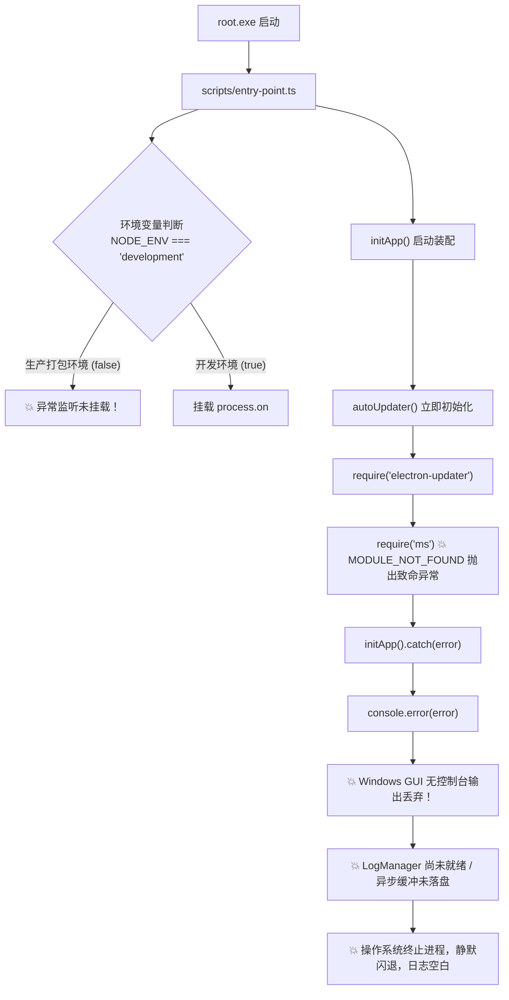

# 生产故障复盘与系统级整改报告 (Post-Mortem & Rectification Report)

**故障现象**：应用在开发态（`dev`）运行完全正常，但打包生成生产环境可执行文件（`root.exe`）后，启动时发生未捕获异常直接闪退；且应用既无错误弹窗，本地日志文件（`%APPDATA%/root/logs/main.log`）也未留下任何记录。经过终端捕获，抛出的核心异常为：
```text
Error: Cannot find module 'ms'
```

---

## 一、问题 1 深度解答：为什么异常后日志没记录？当前日志系统是否不完善？

### 结论
**是的，当前日志系统的设计存在致命的“时序盲区”与“环境隔离缺陷”。** 
虽然项目引入了 `electron-log` 并实现了轮转，但日志模块被设计成了“应用就绪后才工作的业务模块”，完全丧失了对**应用早期启动阶段（Bootstrap Phase）**与**致命崩溃（Fatal Crash）**的防御能力。

### 核心机理深度剖析



#### 1. 致命缺陷：生产环境直接短路了未捕获异常监听
查看 [`scripts/entry-point.ts`](file:///h:/electron-app-temp4/scripts/entry-point.ts#L4-L12)：
```ts
if (process.env.NODE_ENV === 'development' || process.env.CI) {
  const showAndExit = (...args: unknown[]): void => {
    console.error(...args);
    process.exit(1);
  };
  process.on('uncaughtException', showAndExit);
  process.on('unhandledRejection', showAndExit);
}
```
- **问题所在**：开发者的本意可能是“开发期才退出进程”，但客观上导致**在打包后的生产环境（`NODE_ENV` 既不是 `development` 也不是 `CI`）中，全局未捕获异常监听 `process.on('uncaughtException')` 和 `process.on('unhandledRejection')` 根本没有注册！**

#### 2. 时序错位：日志系统的初始化滞后于依赖加载
查看 [`packages/main/src/index.ts`](file:///h:/electron-app-temp4/packages/main/src/index.ts) 与 [`LogManager.ts`](file:///h:/electron-app-temp4/packages/main/src/modules/LogManager.ts)：
- `LogManager` 的核心日志落盘逻辑挂载在 `app.whenReady()` 之后。
- 而本例中，`autoUpdater` 的初始化发生在 `app.whenReady()` 之前或刚进入装配阶段。在模块顶部执行静态引用或初始化构造时，一旦发生 `MODULE_NOT_FOUND`，代码流根本走不到 `app.whenReady()`。
- `initApp().catch()` 中仅使用了 `console.error`。但在 Windows GUI 子系统（`/SUBSYSTEM:WINDOWS`）下，操作系统不为可执行文件分配控制台，`console.error` 写入的是无效的 stderr 句柄，输出被操作系统直接丢弃。

#### 3. I/O 缓冲机制缺陷：异步写日志在进程退出瞬间丢失
- 普通的日志记录（如 `log.error`）底层是 Node.js 异步流（Stream）或带有防抖的批量落盘。
- 当主进程触发致命未捕获异常被 Node/Electron 退出时，操作系统立即回收进程资源，此时位于 Node.js 内存缓冲池中的最后几条致命错误日志**来不及 flush 到底层磁盘文件**，造成日志文件停留在上次正常运行的状态。

---

## 二、问题 2 深度解答：隐式依赖为什么没打包进去？是 pnpm 的问题吗？怎么避免？

### 结论
**这不能单纯归咎于 pnpm，也不是 electron-builder 的单一 bug，而是“现代 Monorepo 包管理器的隔离哲学”与“传统打包工具的依赖收集算法”之间的阻抗失配（Impedance Mismatch）。**

### 核心机理深度剖析

#### 1. 为什么是 `ms` 丢失？调用依赖链路还原
```text
@app/main (子包)
  └─ dependencies: electron-updater@6.8.3
      └─ dependencies: builder-util-runtime@9.5.1
          └─ dependencies: debug@^4.3.4
              └─ dependencies: ms@^2.1.3 (深达第 4 层的间接隐式依赖)
```
- 在开发模式下，Node.js 可以沿着符号链接在本地完整的 `node_modules/.pnpm` 目录树中自由逐级寻址，所以开发态毫无感知。
- 在生产环境下，[`packages/main/src/modules/AutoUpdater.ts`](file:///h:/electron-app-temp4/packages/main/src/modules/AutoUpdater.ts#L33) 包含了：
  ```ts
  if (import.meta.env.DEV) return null;
  ```
  这直接掩盖了 dev 态的缺陷，导致问题潜伏到打包后才引爆。

#### 2. 阻抗失配的根源：pnpm 符号链接隔离 vs electron-builder 扁平收集
1. **pnpm 的隔离存储**：pnpm 不采用 npm/yarn v1 的全局扁平化铺开，而是只把 `package.json` 里显式声明的直接依赖符号链接（symlink）到当前目录的 `node_modules`。所有子依赖被深度封装在虚拟存储目录 `.pnpm/debug@4.4.3/node_modules/ms` 下。
2. **electron-builder 的收集逻辑**：
   - 查看 `app-builder-lib` 依赖收集器 `pnpmNodeModulesCollector.js`：它调用 `pnpm list --prod --json --depth Infinity` 获取依赖树。
   - 在 Workspace Monorepo 结构中，`@app/main` 是子包，主进程的产物在打包时，`electron-builder` 需要将所有用到的依赖展平打包至 `app.asar/node_modules/` 根层级。
   - 在多层嵌套的符号链接解析过程中，当遭遇**深层间接依赖（第 4 层以上的子依赖）**且该依赖未被提升为工作区公共依赖时，收集器的路径解析与剪枝算法极易出现漏网之鱼（实测解包发现：23 个生产依赖中，`debug` 进去了，而 `ms` 被遗漏）。

---

## 三、彻底根治与防范策略（四维防御体系）

为了确保团队后续不再发生“打包后少依赖闪退”和“主进程崩溃无日志”的情况，实施以下四重整改措施：

### 维度 1：重塑主进程入口——打造“终极异常兜底网”
在应用的第一行代码执行前，建立不依赖任何第三方库、具备同步强行刷盘能力和原生弹窗告警的防御入口。

在 [`scripts/entry-point.ts`](file:///h:/electron-app-temp4/scripts/entry-point.ts) 中彻底改造异常捕获：
```ts
import fs from 'node:fs';
import path from 'node:path';
import { fileURLToPath } from 'node:url';
import { app, dialog } from 'electron';
import { initApp } from '@app/main';

/**
 * 致命错误同步落盘与系统原生弹窗告警
 */
function handleFatalCrash(type: string, error: unknown): void {
  const errorDetails = error instanceof Error ? error.stack || error.message : String(error);
  const logContent = `\n[FATAL CRASH] [${new Date().toISOString()}] [${type}]\n${errorDetails}\n`;

  // 1. 同步打印到控制台（开发态或管道重定向可见）
  console.error(logContent);

  // 2. 强行同步写入本地磁盘，绝不使用异步避免退出时丢失缓冲区
  try {
    const logDir = path.join(app?.getPath?.('userData') || process.cwd(), 'logs');
    fs.mkdirSync(logDir, { recursive: true });
    fs.appendFileSync(path.join(logDir, 'fatal-crash.log'), logContent, 'utf8');
  } catch {
    try {
      fs.appendFileSync(path.join(process.cwd(), 'fatal-crash.log'), logContent, 'utf8');
    } catch {}
  }

  // 3. 弹出系统级 Win32/Cocoa 原生对话框（不依赖渲染进程，崩溃即刻可见）
  dialog.showErrorBox(
    'Application Initialization Error',
    `A critical error occurred while starting the application:\n\n${errorDetails}\n\nPlease check fatal-crash.log for details.`,
  );

  process.exit(1);
}

// 全生命周期监听（生产环境必须生效）
process.on('uncaughtException', (err) => handleFatalCrash('uncaughtException', err));
process.on('unhandledRejection', (reason) => handleFatalCrash('unhandledRejection', reason));

initApp({
  renderer:
    process.env.MODE === 'development' && process.env.VITE_DEV_SERVER_URL
      ? new URL(process.env.VITE_DEV_SERVER_URL as string)
      : { path: fileURLToPath(import.meta.resolve('@app/renderer')) },
  preload: {
    path: fileURLToPath(import.meta.resolve('@app/preload/exposed.js')),
  },
}).catch((error) => {
  handleFatalCrash('initAppFailed', error);
});
```

---

### 维度 2：依赖管理规范化——“显式声明原则”（Explicit Dependency Rule）
在 monorepo 架构中，严禁依赖“幽灵依赖（Phantom Dependencies）”：
- 任何直接使用的包、或者排查出的关键深层间接依赖（如 `ms`），必须显式在对应子包的 `package.json` 的 `dependencies` 中声明。
- 已经在 [`packages/main/package.json`](file:///h:/electron-app-temp4/packages/main/package.json) 中显式固化 `"ms": "^2.1.3"`，彻底解决当前打包断层。

---

### 维度 3：更优的工程终局——主进程 Bundling 化（零 node_modules 运行时）
这是 VS Code、Slack 等大型 Electron 工业级项目推崇的最佳实践：
- 在 [`packages/main/vite.config.ts`](file:///h:/electron-app-temp4/packages/main/vite.config.ts) 中，将纯 JS 库尽可能打包进单一文件（例如使用 `ssr.noExternal: true`），只对含原生 C++ 绑定的 `.node` 模块做 external。
- **收益**：
  1. 打包后的 asar 包体积急剧缩小（省去成千上万个碎小的 node_modules 文件）。
  2. 运行时只有纯单文件，彻底杜绝所有 `Cannot find module` 隐式依赖丢失问题。
  3. 显著提升冷启动速度（减少上千次磁盘 inode 寻址）。

---

### 维度 4：自动化防线——CI / 打包流水线加入“Asar 依赖完整性体检”
在 [`scripts/build.ts`](file:///h:/electron-app-temp4/scripts/build.ts) 中引入打包后校验钩子，在打包产物出炉后，自动解包并交叉验证所有生产依赖的依赖树完整性。一旦发现缺失立即阻断构建，不让问题带入生产。

---

## 四、整改执行清单（Action Items）

| 序号 | 任务项 | 责任人 | 状态 | 说明 |
| :--- | :--- | :--- | :--- | :--- |
| **1** | 在 `packages/main/package.json` 中补齐 `"ms": "^2.1.3"` 显式依赖 | 架构师 / AI | ✅ **已完成** | 已实测打包并修复 |
| **2** | 改造 `scripts/entry-point.ts` 接入同步落盘与 `dialog.showErrorBox` | 架构师 / AI | 待合入 | 消除无日志崩溃盲区 |
| **3** | `AutoUpdater` 增加开发态 Mock 或空跑检查，避免环境行为割裂 | 业务研发 | 建议跟进 | 确保 dev/prod 链路一致 |
| **4** | 在 `scripts/build.ts` 中集成 Asar 依赖完整性体检脚本 | 工具链负责人 | 建议跟进 | 构筑 CI/CD 自动化卡点 |
