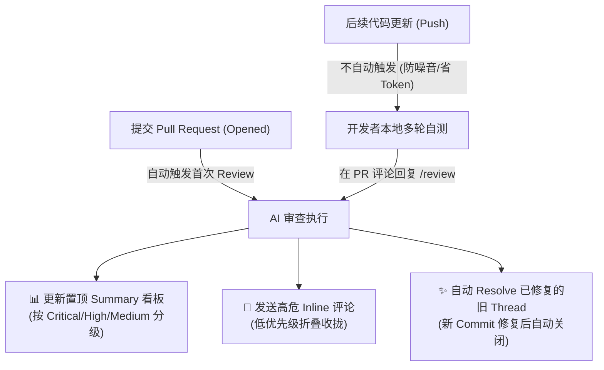
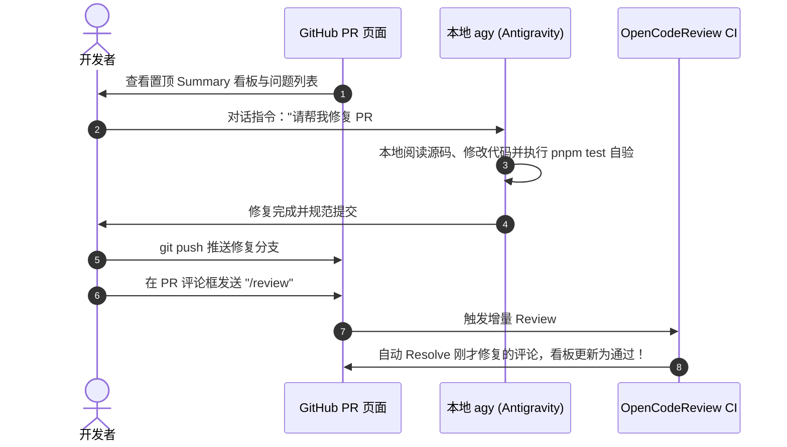

# AI 代码审查 (OpenCodeReview) 作业指南

> 本文档规范了本仓库在 Pull Request (PR) 流程中集成 **OpenCodeReview (OCR)** 的运作机制、触发方式、噪声治理策略以及与 AI Agent (agy) 协同修复的最佳实践。

---

## 🎯 1. 核心机制概览

本仓库接入了基于大语言模型的代码审查工具 `alibaba/open-code-review`，并进行了深度定制优化：



### 1.1 真增量审查 (`checkpoint_range: true`)
- **初次开 PR**：从 `merge-base` 到最新 commit 进行全量审查。
- **后续复查**：Bot 在置顶看板中记录上次审查的 commit 检查点。后续审查**仅对 `<checkpoint>..<new head>` 之间的纯增量提交进行扫描**，避免重复审查旧代码。
- **不重复评论 (`incremental: true`)**：即使增量范围有交集，相同代码行也不会重复发送雷同评论。

### 1.2 置顶动态看板 (`sticky_summary: true`)
- Bot 首次运行会在 PR 讨论区发布一条带有隐式签名（`<!-- ocr-summary -->`）的看板。
- 后续轮次的审查结果将通过 GitHub API **直接原地更新（PATCH）这一条看板**，避免反复发布主评论造成 PR 刷屏。

### 1.3 噪声治理与折叠 (`route_severity_below: low`)
- **高危问题（Critical / High / Medium）**：直接在代码差异行内生成 Inline Comment，便于就地查阅。
- **次要建议（Low / Style / Lint）**：自动收拢至置顶 Summary 看板的折叠区域 `<details>` 中，行内评论噪点减少 70% 以上。

### 1.4 自动关闭过时评论 (`resolve_outdated: true`)
- 当你在后续 commit 中修改了原来报错的代码行后，GitHub 会自动将其标记为 `isOutdated`。
- Bot 在下一轮审查确认该位置没有再次报错后，会自动调用 GraphQL API 将该 Review Thread 标记为 **Resolved**。
- **保护机制**：有人类参与讨论的 Thread、已手动关闭的 Thread、或者新代码依然存在问题的 Thread，**绝对不自动关闭**。

---

## 🚀 2. 触发方式与交互指令

| 操作场景 | 触发方式 | 说明 |
| :--- | :--- | :--- |
| **新建 PR / Reopen** | ⚡ **自动触发** | PR 创建或从 Draft 转为 Ready 时自动启动首轮全面检查 |
| **后续提交代码 (Push)** | ⏸️ **静默不触发** | 允许开发者多次 commit 与 push，避免 CI 反复排队和 Token 浪费 |
| **手动请求复查** | 💬 **PR 评论 `/review` 或 `/ocr`** | 增量审查新增的 commit，刷新置顶看板，并自动 resolve 已修复的问题 |

> 💡 **小贴士**：如果进行了大面积文件重构，希望跳过 checkpoint 执行从头到尾的全量扫描，可在工作流手动调度中传入 `full_review: true`。

---

## 🤖 3. 与 agy 协同修复的最佳实践

推荐采用**“网页快速决策 ➔ 本地 agy 驱动修复 ➔ 指令闭环”**的高效链路：



### 协同步骤：
1. **查看 PR 看板**：打开 PR 页面，浏览置顶的 `OpenCodeReview Summary` 表格。
2. **快速裁决**：
   - 需要修复的：记录问题描述或行号。
   - 虚假报警或业务特殊设计的：无需理会或在 PR 回复说明。
3. **委托 agy 修复**：
   - 直接在对话框告诉 agy：  
     > “请参考 PR 看板的建议：修复 `packages/main/src/auth.ts` 中可能存在的空指针异常，并保持原有测试通过。”
   - agy 会自动定位源码、编写健壮性逻辑并运行本地门禁。
4. **一键闭环**：
   - 推送代码到分支后，在 PR 评论回复一条 `/review`。
   - 之前由该问题引起的行内评论将被 Bot **自动关闭**，PR 恢复整洁。

---

## ⚙️ 4. 工作流配置与密钥说明

审查工作流定义于 [`.github/workflows/open-code-review.yml`](file:///h:/electron-app-temp5/.github/workflows/open-code-review.yml)。

### 必需权限
```yaml
permissions:
  contents: write       # 必需：修改 Review Thread 状态执行 resolveReviewThread
  pull-requests: write  # 必需：发表行内评论与 Summary
  issues: write         # 必需：监听并响应 PR 评论
```

### 必需 Repository Secrets
- `OCR_LLM_URL`：兼容 OpenAI 规范的 API 端点地址。
- `OCR_LLM_TOKEN`：API 访问密钥。
- `OCR_LLM_MODEL`：模型名称（如 `gpt-4o`、`claude-3-7-sonnet`、`qwen-max`）。
