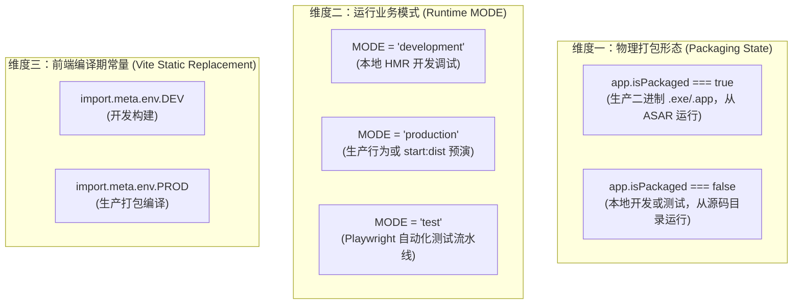

# 全栈运行环境与模式控制规范 (Environment Specification)

本文档定义了本项目在 Electron Monorepo 架构下的运行环境划分标准、环境变量（`MODE`）控制机制、跨端门面访问规范以及自动化测试安全隔离原则。

---

## 一、 架构背景与核心原则

### 1. 为什么传统的环境变量判定容易踩坑？
在传统 Electron 客户端开发中，开发者常常习惯直接读取 `process.env.NODE_ENV` 或 `process.env.MODE`，极易引发严重生产事故：
1. **Windows 打包二进制变量丢失陷阱**：
   用户从开始菜单或安装目录双击运行打包后的 `.exe` 时，操作系统不会注入任何 Node 终端变量。此时 `process.env.MODE` 与 `process.env.NODE_ENV` 均为 `undefined`！
   - *反面教材*：若编写 `if (process.env.MODE !== 'production')`，在生产环境安装包中会因为 `undefined !== 'production'` 被**致命误判为开发态**，导致静默更新失灵、Sentry 误关、甚至暴露 Dev Mock 数据。
2. **`NODE_ENV` 与 `MODE` 概念混淆**：
   - `NODE_ENV` 诞生于早期 Node.js 生态，核心职责是**控制底层三方库的编译优化与断言等级**（如 React 的优化模式）；
   - `MODE` 诞生于 Webpack/Vite 现代构建体系，核心职责是**控制业务配置集与应用部署模式（Profile）**。
   - 二者在业务代码中随意混用会导致概念割裂。
3. **多模块散装读取**：
   各业务 Service、Controller 或组件各自读取原始 `process.env.*`，导致修改一处、遗漏百处。

### 2. 核心治理原则
1. **彻底摒弃内部对 `NODE_ENV` 的依赖**：项目内部所有模式控制 100% 统一基于 `MODE`（取值收敛为 `'development' | 'production' | 'test'`）。
2. **物理形态与业务模式严格解耦**：区分应用是“已安装打包”还是“源码运行”，物理真理源唯一认准 Electron 官方原生 API `app.isPackaged`。
3. **严禁业务散装读取，一律使用门面**：主进程与渲染进程必须分别通过各自封装的 `env.ts` 门面访问环境状态。

---

## 二、 三维正交环境模型

本项目将运行状态划分为三个互不耦合的正交维度：



| 维度 | 权威真理源 | 适用端 | 语义解释与取值 |
| :--- | :--- | :--- | :--- |
| **物理形态** | `app.isPackaged` | 主进程（Native） | `true`（生产打包安装态） / `false`（源码启动态）。不受任何环境变量伪造影响。 |
| **业务模式** | `process.env.MODE` | 主进程 / 构建脚本 | `'development'`（本地调试） / `'production'`（生产行为） / `'test'`（自动化测试）。 |
| **静态编译** | `import.meta.env.DEV` / `PROD` | 渲染进程 (Vite) | 编译期由 Vite 静态内联替换为布尔字面量，用于前端死代码剔除。 |

---

## 三、 全栈门面体系架构

为了让各端拥有清晰、安全的调用契约，项目建立了三级门面系统：

### 1. 跨端契约层 (`@app/shared`)
在 [`packages/shared/src/constants/env.ts`](../packages/shared/src/constants/env.ts) 与 [`types/env.ts`](../packages/shared/src/types/env.ts) 中定义全局唯一环境枚举：
```ts
export const APP_ENV = {
  DEVELOPMENT: 'development',
  PRODUCTION: 'production',
  TEST: 'test',
} as const;

export type AppEnv = (typeof APP_ENV)[keyof typeof APP_ENV];
```

### 2. 主进程权威门面 (`packages/main/src/env.ts`)
主进程所有业务逻辑统一从 [`packages/main/src/env.ts`](../packages/main/src/env.ts) 获取环境状态：
```ts
import { app } from 'electron';
import { APP_ENV, type AppEnv } from '@app/shared/constants/env';

/** 是否处于自动化测试环境 (Playwright / Vitest)，由测试启动器注入 MODE=test */
export const isTest: boolean = process.env.MODE === 'test';

/** 是否处于已打包二进制分发形态 (.exe / .app)，Electron 官方权威判定 */
export const isPackaged: boolean = app.isPackaged;

/** 是否处于本地开发态：未打包 + 非测试 + MODE 未显式指定为 production */
export const isDev: boolean = !isPackaged && !isTest && process.env.MODE !== 'production';

/** 是否处于生产行为态：非测试 + (已打包 或 MODE 为 production 预览) */
export const isProd: boolean = !isTest && (isPackaged || process.env.MODE === 'production');

/** 获取当前权威运行环境语义 ('development' | 'production' | 'test') */
export function getAppEnv(): AppEnv {
  if (isTest) return APP_ENV.TEST;
  if (isDev) return APP_ENV.DEVELOPMENT;
  return APP_ENV.PRODUCTION;
}

export const currentAppEnv: AppEnv = getAppEnv();

/** 本地开发服务器 URL (若存在且处于开发态) */
export const devServerUrl: string | undefined =
  isDev && process.env.VITE_DEV_SERVER_URL ? process.env.VITE_DEV_SERVER_URL : undefined;
```

### 3. 渲染进程统一门面 (`packages/renderer/src/lib/env.ts`)
渲染进程组件与逻辑统一从 [`packages/renderer/src/lib/env.ts`](../packages/renderer/src/lib/env.ts) 消费：
```ts
import { APP_ENV, type AppEnv } from '@app/shared/constants/env';

export const isDev: boolean = import.meta.env.DEV;
export const isProd: boolean = import.meta.env.PROD;
export const currentAppEnv: AppEnv = isDev ? APP_ENV.DEVELOPMENT : APP_ENV.PRODUCTION;
```

---

## 四、 为什么 E2E 必须设定为 MODE='test'？

在端到端（E2E）自动化测试中，必须显式注入 `MODE='test'`，这是出于以下四大核心工程防护考量：

### 1. 进程生命周期保活（防被应用自杀中断测试）
- **痛点**：在生产和开发模式下，当触发 OTA 更新安装时，代码会调用 `autoUpdater.quitAndInstall()` 或 `app.quit()` 退出应用。
- **后果**：如果 E2E 未设置测试模式，测试用例刚点击“立即安装”，Electron 进程瞬间物理退出并尝试在本地操作系统弹窗安装！Playwright 与主进程的 CDP/WebSocket 通道瞬间中断崩溃（Broken Pipe），整个测试套件挂死报错。
- **测试模式防护**：在 `isTest` 下，`install()` 仅返回 `{ success: true }` 协议结果，不执行物理退出，保证测试能够完整跑完并完成断言。

### 2. 消除时间竞态与网络波动，保障 100% 确定性 (Determinism)
- **痛点**：开发模式为了调试体验，往往包含定时模拟器（如 `setTimeout` 1500ms 模拟下载推进）；生产模式则会发起真实的 GitHub Releases 请求。
- **后果**：在自动化测试流水线中，不可控的真实网络延迟与内置的固定定时器会引发严重的“测试竞态 (Race Condition)”，导致测试偶发失败（Flaky Tests）。
- **测试模式防护**：测试模式下彻底阻断一切真实网络与自发计时器，所有状态流转（如 25% -> 50% -> 100% -> downloaded）全部由测试脚本显式指令精确步进。

### 3. 测试特权桩的安全隔离（防后门外泄至生产）
- **痛点**：测试脚本需要能够注入模拟异常（如“模拟下载中断重试”）。我们在主进程开放了特权注入通道 `IPC_CHANNELS.UPDATER_MOCK_EMIT`。
- **测试模式防护**：该 IPC 通道**仅在 `isTest` 为真时动态挂载**。在开发态与生产二进制中，该通道物理不存在，从根源上杜绝了特权测试接口被恶意代码利用的安全隐患。

### 4. 消除后台自发动作的干扰（用例独立性隔离）
- **痛点**：应用启动时可能会安排延时后台任务（例如：启动 3 秒后若开启自动更新则执行后台静默检查）。
- **测试模式防护**：在 `isTest` 下，后台静默检查器直接短路退出，防止在执行其他测试（如外观主题、多语言、窗口拖拽）时突然弹出更新日志弹窗干扰 UI。

---

## 五、 开发纪律与红线禁令 (Do's & Don'ts)

### 🔴 严禁行为 (Redlines)
1. **严禁在业务代码中直接读取原始环境变量**：
   - ❌ `process.env.MODE === 'development'`
   - ❌ `process.env.NODE_ENV === 'test'`
   - 必须统一通过门面导入使用：`import { isDev, isTest, isProd } from '@/env'`。
2. **严禁使用反向否定逻辑判定生产环境**：
   - ❌ `const isProduction = process.env.MODE !== 'development';` （打包后的 `.exe` 中 `MODE` 为 `undefined`，会导致误判！）。
   - ✅ 正确做法：直接使用门面中的 `isProd`。
3. **严禁在 E2E 测试启动器中漏传 `MODE: 'test'`**：
   - 所有在 E2E 体系下拉起 Electron 的代码（如 `e2e/helpers/electron.ts`），必须确保注入 `MODE: 'test'`。

### 🟢 推荐实践 (Best Practices)
1. **新增环境相关状态**：统一在 `packages/main/src/env.ts`（主进程）或 `packages/renderer/src/lib/env.ts`（渲染进程）中扩充导出，禁止在具体 Service 内部自行计算。
2. **底层探针暴露**：主进程底层探针（如 `SystemService.getSystemInfo()`）应主动返回 `{ env: currentAppEnv, isPackaged }`，供渲染端与调试卡片排查问题。
