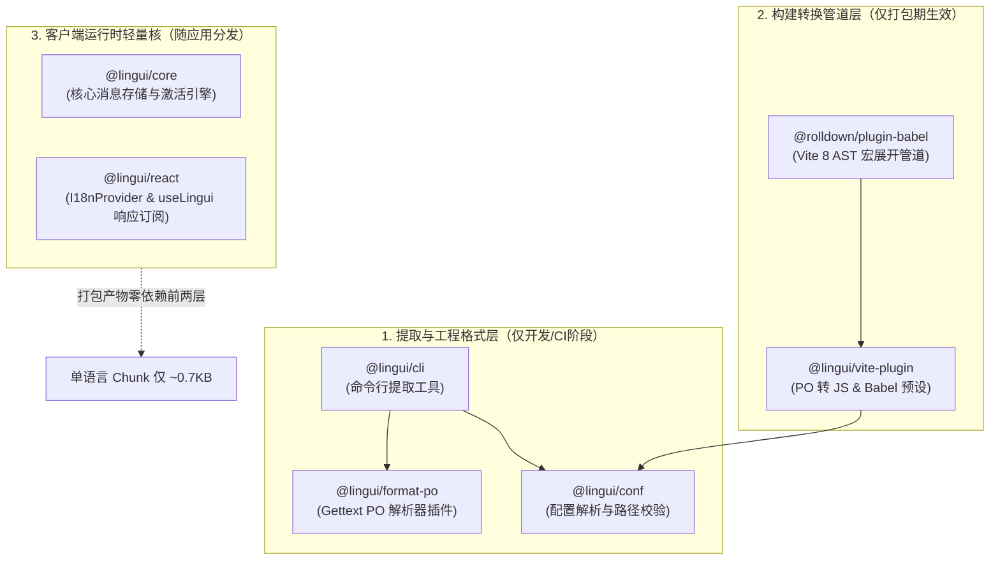
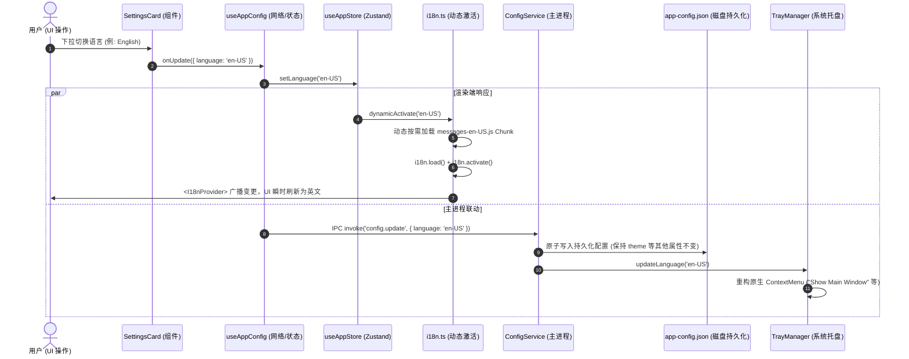

# 多语言（i18n）全链路工程架构设计指南

本文档深入解析本模板多语言国际化体系的**架构设计理念、核心技术选型、编译构建管道、跨进程通信时序与工程化解耦模型**。

> 📖 **配套指引**：如果您需要在日常业务开发中新增、修改或翻译文案，请参考开发者实操手册：[多语言日常开发与维护 SOP 指南](./guide.md)。

---

## 目录
- [一、 技术选型权衡与核心设计理念](#一-技术选型权衡与核心设计理念)
- [二、 模块解耦与分层依赖剖析](#二-模块解耦与分层依赖剖析)
- [三、 构建链流水线与性能极致优化](#三-构建链流水线与性能极致优化)
- [四、 跨进程全生命周期时序与联动](#四-跨进程全生命周期时序与联动)
- [五、 质量守护与防冲刷架构原则](#五-质量守护与防冲刷架构原则)

---

## 一、 技术选型权衡与核心设计理念

桌面客户端应用作为高内聚、高交互密度的系统软件，其多语言架构直接决定了**工程可维护性、Bundle 体积、AI 辅助编程效率以及跨进程体验一致性**。

### 1. 行业方案深度对比矩阵

| 评估维度 | 传统全量运行时方案<br>`react-i18next` | 自研/散装方案<br>`JSON Key-Value` | 编译型中文优先方案（本工程）<br>**`LinguiJS (Source-as-Key)`** |
| :--- | :--- | :--- | :--- |
| **源码编写方式** | 抽象伪 Key：`t('settings.theme.dark')` | 散装变量：`locales[lang].darkTheme` | **自然中文**：`t\`深色模式 (Dark)\`` |
| **AI 编程友好度** | **差**：AI 需跨文件记忆无语义 Key，极易写错或丢失映射 | **差**：无法静态分析，AI 容易产生冗余散装字段 | **极高**：AI 读写直接使用自然语言，语义自解释 |
| **编译期语法验证** | 无（拼写错误运行时静默回退或白屏） | 弱（需手写巨大 TS 类型体操） | **强**（编译期通过 AST 宏展开为确定性 ID） |
| **语言包 Chunk 拆分** | 默认全量打包进主 Bundle，拆分需大量样板代码 | 需手动按语言拆分动态 `import` | **零配置原生支持动态 Import 按需 Chunk 拆分** |
| **单语言产物开销** | 臃肿（包含运行时解析器与完整 JSON 字典） | 轻量（但缺少复数/上下文高级语法） | **极致轻量（本工程单语言 Chunk 仅 ~0.7KB）** |
| **文案更新心智** | 频繁在 TSX 与各 `json` 文件间上下文切换 | 手动维护各语言文件，易遗漏漏翻 | **一键命令行增量提取**（`pnpm i18n:extract`） |

### 2. 为什么坚持「中文优先（Source-as-Key）」？

传统国际化方案要求开发者在编写 UI 时，必须提前构想一个类似 `settings.feature.minimizeToTray.desc` 的命名空间 Key。在敏捷迭代与 AI 协同开发场景下，这带来了三个严重负担：
1. **命名心智浪费**：开发者必须在“想变量名”和“写业务逻辑”之间来回切换；
2. **源码可读性极低**：脱离字典文件后，排查代码无法一眼看出对应 UI 呈现什么内容；
3. **AI 维护灾难**：大语言模型生成代码时，容易创造不存在的 Key，或破坏既有字典结构。

**LinguiJS 理念**：代码以业务最常用的默认母语（简体中文）作为单一事实源（Single Source of Truth），直接写在 JSX/TSX 中。在打包期，Babel 宏会自动对中文文本进行哈希计算生成稳定 ID（如 `id: "b0y0iF"`），编译为轻量方法调用；运行时仅需加载对应语言的 PO 字典，实现**高可读性与零运行时损耗**。

---

## 二、 模块解耦与分层依赖剖析

LinguiJS 遵循经典的**关注点分离（Separation of Concerns）**软件工程原则。我们将依赖明确划分为三层，这也是为何项目中会有多个 `@lingui/*` 包的原因：



### 依赖职责明细表

| 依赖包名 | 归属生命周期 | 职责与必要性说明 |
| :--- | :--- | :--- |
| **`@lingui/core`** | 生产运行时 (Runtime) | 底层国际化核心，负责语言目录挂载（`load`）、当前语言激活（`activate`）及 ICU 变量插值解析。 |
| **`@lingui/react`** | 生产运行时 (Runtime) | React 胶水层，基于 React 18+ 官方 `useSyncExternalStore` 实现高性能上下文广播，通知组件树刷新。 |
| **`@lingui/vite-plugin`** | 构建期 (Build-time) | 1. 允许 Vite 原生 `import './messages.po'`；<br>2. 输出适配 Vite 8 的编译期宏转换器 Babel 预设。 |
| **`@rolldown/plugin-babel`** | 构建期 (Build-time) | Vite 8 官方底层 Rolldown 引擎的 Babel 管道，负责在打包阶段截获 `t` 宏并转换为无副作用的函数调用。 |
| **`@lingui/conf`** | 开发/构建期 | 统一校验并加载 `lingui.config.ts`，锁定工程多语言规则。 |
| **`@lingui/format-po`** | 开发/构建期 | 采用 GNU Gettext 标准 `.po` 格式驱动。该格式原生支持上下文注解、代码位置溯源，人类与 AI 均极度易读。 |
| **`@lingui/cli`** | 开发辅助 (Dev) | 提供一键提取命令行，扫描全工程 AST 并增量更新 `.po` 文件。 |

---

## 三、 构建链流水线与性能极致优化

在集成 Vite 8 + Rolldown 现代化前端工具链的过程中，我们攻克了多项深层兼容陷阱：

### 1. 宏展开与编译期清洗（规避 Bundle 体积暴增）
- **致命陷阱**：在早前试验中，如果使用旧版 `from '@lingui/macro'`，由于该路径已被废弃，Vite 的 Babel 预设正则过滤器 `from ['"](?:@lingui/core/macro|@lingui/react/macro)['"]` 会直接跳过转换。宏未在编译期展开，最终导致 Node 端的开发工具（`jiti`、`lilconfig`）被全量打进浏览器 JS，引发客户端运行时 `fs.readFile undefined` 致命崩溃，Bundle 体积膨胀超过 500KB。
- **治理方案**：全工程严格使用官方标准路径：
  ```tsx
  import { t } from '@lingui/core/macro';
  ```
  在 Rolldown 打包时，代码中的 `t`总览看板`` 会被直接转译为：
  ```js
  QL._({ id: "Yn8mWA" }) // 纯静态字符串哈希映射调用
  ```
  所有宏与编译依赖在打包后**完全消失**，主产物体积瞬间缩减 **536KB**。

### 2. 独立 Chunk 代码分割（Runtime Code-Splitting）
语言包绝不随着 `index.html` 首次请求一次性下载全量字典。在 [packages/renderer/src/locales/i18n.ts](file:///h:/electron-app-temp5/packages/renderer/src/locales/i18n.ts) 中通过动态按需导入：

```ts
export async function dynamicActivate(locale: SupportedLocale): Promise<void> {
  if (locale === 'en-US') {
    const { messages } = await import('./en-US/messages.po');
    i18n.load('en-US', messages);
  } else {
    const { messages } = await import('./zh-CN/messages.po');
    i18n.load('zh-CN', messages);
  }
  i18n.activate(locale);
  document.documentElement.lang = locale;
}
```

**产物实测指标**：
- `messages-zh-CN.js`：`0.77 kB`（Gzip: `0.64 kB`）
- `messages-en-US.js`：`0.72 kB`（Gzip: `0.48 kB`）
完全实现了独立分包，用户切换至何种语言，仅动态加载对应的一百字节极小 Chunk。

### 3. Windows 跨平台路径与 CWD 锁定
- **Glob 反斜杠问题**：Windows 系统下 `path.resolve` 输出 `\` 反斜杠，这会使 Glob 模式引擎将其视作转义符而无法匹配。在 `vite.config.ts` 中采用稳健的正则表达式过滤器：`include: [/\.[jt]sx?$/]`。
- **Monorepo CWD 漂移治理**：在工程根目录运行开发服务（`pnpm start`）时，`process.cwd()` 为根路径。为了防止 Lingui 查找器从根目录单向向上查找而漏掉子包配置，在 [packages/renderer/vite.config.ts](file:///h:/electron-app-temp5/packages/renderer/vite.config.ts) 中显式传入绝对路径与 `cwd`：
  ```ts
  const linguiConfigOpts = {
    configPath: path.resolve(__dirname, 'lingui.config.ts'),
    cwd: __dirname,
  };
  ```

---

## 四、 跨进程全生命周期时序与联动

桌面应用的多语言不仅局限于 React 组件界面，还牵涉到：
1. **渲染端持久化状态与 UI 同步**；
2. **主进程 ConfigStore 落盘存储**；
3. **原生系统托盘（Tray）上下文菜单动态重构**。

### 全链路协同流程时序图



### 穿透 `React.memo` 阻断机制
在设计良好的组件树中，展示组件（如 `Header`、`CounterCard`）通常被 `React.memo` 包裹以避免不必要的渲染。由于 `t` 宏经由哈希处理后依赖全局 Context 上下文，纯展示组件如果自身没有 Props 变更，会默认阻断渲染。
我们在需要感知多语言变更的 Memo 组件内部显式挂载订阅：
```tsx
import { useLingui } from '@lingui/react';

const _Header = (props: IHeaderProps) => {
  useLingui(); // 关键：建立 Context 响应式订阅，通知 React 即使 Props 未变也需刷新文案
  // ...
};
```

---

## 五、 质量守护与防冲刷架构原则

### 1. Zod Schema 防冲刷隔离设计
本工程彻底杜绝了修改某项配置意外导致其他配置被“恢复出厂默认值”的深坑。在 [packages/shared/src/schemas/config.ts](file:///h:/electron-app-temp5/packages/shared/src/schemas/config.ts) 中严格遵循基底分离模式：

```ts
// 1. 无默认值的基底属性约束
export const configBaseSchema = z.object({
  theme: themeModeSchema,
  language: languageSchema,
  minimizeToTray: z.boolean(),
  autoCheckUpdate: z.boolean(),
});

// 2. 完整读取模型：赋予默认值
export const configSchema = configBaseSchema.extend({
  theme: themeModeSchema.default('system'),
  language: languageSchema.default('zh-CN'),
  minimizeToTray: z.boolean().default(true),
  autoCheckUpdate: z.boolean().default(true),
});

// 3. 局部更新输入模型：基于基底做 partial()，绝不掺杂默认值注入
export const updateConfigInputSchema = configBaseSchema.partial();
```

### 2. 自动化回归测试锁定（Playwright E2E）
所有特性在交付前均由真实的 Electron 进程自动化测试（`pnpm run test:e2e:build`）进行全天候覆盖拦截：
- **用例 2**：全链路多语言切换验证（UI 标题、Tab 单选框、设置卡片、Counter 计数器及主进程托盘右键菜单文案双向切换）；
- **用例 4（核心卫士）**：连续修改 Theme -> Language -> TraySwitch，断言各特性状态完全隔离互不冲刷，并验证磁盘落盘的 `app-config.json` 数据一致性。
