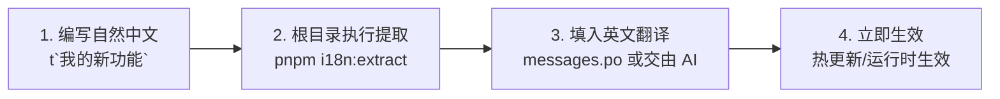

# 多语言日常开发与维护实操手册 (Developer SOP)

本手册专为日常业务开发量身定制，指导开发者与 AI 如何在项目中**规范编写自然中文、一键增量提取词条、高效维护翻译字典，以及规避高频陷阱**。

> 🏗️ **底层原理**：关于技术选型对比、Vite 8 编译管道与 Chunk 拆分机制，请参阅：[多语言全链路工程架构设计指南](./architecture.md)。

---

## 目录
- [一、 30 秒极速上手工作流](#一-30-秒极速上手工作流)
- [二、 文案编写语法规范与示例](#二-文案编写语法规范与示例)
- [三、 自动化词条提取命令行](#三-自动化词条提取命令行)
- [四、 PO 字典维护与 AI 批量翻译工作流](#四-po-字典维护与-ai-批量翻译工作流)
- [五、 高频避坑与开发禁忌 Checklist](#五-高频避坑与开发禁忌-checklist)
- [六、 扩展新增第三语种（如日语、韩语）指南](#六-扩展新增第三语种如日语韩语指南)

---

## 一、 30 秒极速上手工作流

在本工程中新增或修改一个界面的多语言，仅需三步：



1. **写代码**：在 TSX 中像平时写纯中文一样，直接使用 `t` 模板宏包裹文案：
   ```tsx
   import { t } from '@lingui/core/macro';

   <Button>{t`保存并提交`}</Button>
   ```
2. **提取词条**：在工程根目录下执行一键提取命令：
   ```bash
   pnpm i18n:extract
   ```
3. **补充英文**：打开自动更新的 `packages/renderer/src/locales/en-US/messages.po`，为新增词条补充英文翻译（或直接让 AI 批量补齐），保存即大功告成！

---

## 二、 文案编写语法规范与示例

### 1. 基础自然文本标记（最常用）

在 JSX 属性、文本节点或选项列表中，直接使用 `t` 宏：

```tsx
import { t } from '@lingui/core/macro';

export const MyFeature = () => {
  return (
    <div>
      {/* 文本节点 */}
      <h1>{t`系统通知中心`}</h1>
      
      {/* 属性传参 */}
      <Input placeholder={t`请输入搜索关键词...`} />
    </div>
  );
};
```

### 2. 动态变量与表达式插值

当文案中包含动态数值、用户名等变量时，直接在模板字符串中使用原生 `${}` 插值语法，Lingui 会自动将其编译为标准的 ICU 消息占位符：

```tsx
import { t } from '@lingui/core/macro';

const userName = 'Alice';
const unreadCount = 5;

// 提取后会自动转换为: "欢迎回来，{userName}！您有 {unreadCount} 条新消息。"
const greeting = t`欢迎回来，${userName}！您有 ${unreadCount} 条新消息。`;
```

在 `messages.po` 英文翻译中，直接保留同名变量即可：
```po
msgid "欢迎回来，{userName}！您有 {unreadCount} 条新消息。"
msgstr "Welcome back, {userName}! You have {unreadCount} unread messages."
```

### 3. 富文本与 JSX 标签嵌套（`<Trans>` 组件）

当文案内部嵌套了链接、高亮样式或粗体文本等复杂结构时，使用 `<Trans>` 宏组件：

```tsx
import { Trans } from '@lingui/react/macro';

<p>
  <Trans>
    如果您需要技术支持，请前往 <a>官方 GitHub 仓库</a> 提交 Issue。
  </Trans>
</p>
```

### 4. 纯 TS/JS 文件与 Hook 外部使用

在 React 组件树外部（例如常规工具函数或状态层），同样直接导入 `t` 即可：

```ts
import { t } from '@lingui/core/macro';

export function getStatusText(status: 'online' | 'offline') {
  return status === 'online' ? t`设备在线` : t`设备已离线`;
}
```

---

## 三、 自动化词条提取命令行

在工程根目录运行统一提取脚本：

```bash
pnpm i18n:extract
```

该命令本质执行的是：`pnpm --filter @app/renderer exec lingui extract --clean`。

### 提取控制台日志解读

```text
√ Done in 498ms
Catalog statistics for src/locales/{locale}/messages: 
┌────────────────┬─────────────┬─────────┐
│ Language       │ Total count │ Missing │
├────────────────┼─────────────┼─────────┤
│ zh-CN (source) │     20      │    -    │
│ en-US          │     20      │    1    │
└────────────────┴─────────────┴─────────┘
```
- `Total count`：当前工程扫描到的总文案词条数；
- `Missing`：当前语种尚未提供翻译的词条数量（上图中代表 `en-US` 有 1 个新词条待翻译）。
- `--clean` 参数说明：自动清理在代码中已被彻底删除的废弃历史文案，保持字典精简无死词。

---

## 四、 PO 字典维护与 AI 批量翻译工作流

### 1. `.po` 文件结构认知

提取后的 `packages/renderer/src/locales/en-US/messages.po` 文件格式极其简明直观：

```po
#: src/components/layout/Header.tsx
msgid "总览看板"
msgstr "Dashboard"

#: src/features/my-feature/MyCard.tsx
msgid "保存并提交"
msgstr ""
```
- `#: ...`：自动标注的来源代码文件路径，方便追溯业务场景；
- `msgid`：代码中书写的**原始中文**（单一事实源）；
- `msgstr`：对应的英文译文。如果为空（`""`），运行时在英文模式下会回退显示中文原词，不产生运行时白屏或崩溃。

### 2. 让 AI（LLM）一键批量补齐缺失翻译（Prompt 模板）

当运行 `pnpm i18n:extract` 发现有多个新增的 `msgstr ""` 时，您无需人工逐个翻译，直接复制以下 Prompt 给 AI 助手即可：

> **📋 给 AI 的提示词模板**：
> 
> ```markdown
> 我正在为一个企业级 Electron 桌面客户端（技术栈：React + Vite + LinguiJS）补充英文多语言翻译。
> 请帮我把以下 .po 文件中 msgstr 为空项补全为地道、专业的软件界面英文翻译。
> 
> 【约束规则】：
> 1. 保留原本的代码注释行（`#: ...`）与 `msgid` 内容绝对不要改动；
> 2. 如果存在 `{variable}` 占位符变量，翻译中必须原样保留；
> 3. 仅输出补充好 msgstr 后的完整 .po 文本块。
> 
> 【待补充的 PO 内容】：
> （在此粘贴 messages.po 中待翻译的片段）
> ```

---

## 五、 高频避坑与开发禁忌 Checklist

在日常编码与 PR 审查中，请务必检查以下 5 条硬性约束：

### ❌ 禁忌 1：宏导入路径写错（导致打包体积膨胀与运行时崩溃）
- **错误写法**：`import { t } from '@lingui/macro';` （已废弃，且会使 Vite 跳过 AST 转换，导致客户端被塞入 Node 依赖并报错 `fs.readFile undefined`）；
- **正确写法**：必须从 `@lingui/core/macro` 导入 `t`，从 `@lingui/react/macro` 导入 `Trans`：
  ```tsx
  import { t } from '@lingui/core/macro';
  import { Trans } from '@lingui/react/macro';
  ```

### ❌ 禁忌 2：`React.memo` 组件漏接 `useLingui()` 订阅
- **排查现象**：切换语言后，页面的其他卡片文案都变了，但某个卡片（如 Header 导航项）依然显示旧语言。
- **原因与解法**：该组件被 `React.memo` 包裹，且自身 Props 未发生变化，阻止了重新渲染。必须在组件函数内部显式挂载订阅：
  ```tsx
  import { useLingui } from '@lingui/react';

  const MyCard = memo(() => {
    useLingui(); // 必加：穿透 React.memo 建立语言变更高性能监听
    return <div>{t`我的文案`}</div>;
  });
  ```

### ❌ 禁忌 3：裸模板字符串混淆语法
- **错误写法**：`` t(`${name} 的主页`) `` 或拼装字符串 `t`欢迎` + name`；
- **正确写法**：直接利用带标签的模板字符串：
  ```tsx
  t`${name} 的主页`
  ```

### ❌ 禁忌 4：滥用国际化包裹纯技术名词与全局固定词
- 专有名词（如 "Electron", "Vite", "ID", "CPU", "HTTP", "GitHub"）以及纯数字、系统物理单位等，无需使用 `t` 包裹，保持纯静态字符串即可。

### ❌ 禁忌 5：直接在主进程（Main）使用 `@lingui/core/macro`
- `@lingui/vite-plugin` 目前作用于 `packages/renderer`（渲染进程）编译链。
- 如果主进程有极少量的系统级原生 UI（如系统托盘 Tray 上下文菜单），应遵循主进程标准模块规范，在 `packages/main/src/modules/tray.module.ts` 的 `updateLanguage(lang)` 方法中提供对应的中英文标签映射。

---

## 六、 扩展新增第三语种（如日语、韩语）指南

如未来业务拓展需要接入第三种语言（以韩语 `ko-KR` 为例），只需标准化执行以下 4 步：

1. **更新配置文件**：在 [packages/renderer/lingui.config.ts](file:///h:/electron-app-temp5/packages/renderer/lingui.config.ts) 中增加语言代码：
   ```ts
   locales: ['zh-CN', 'en-US', 'ko-KR'],
   ```
2. **初始化并提取**：在根目录下执行提取命令：
   ```bash
   pnpm i18n:extract
   ```
   CLI 会自动在 `packages/renderer/src/locales/ko-KR/messages.po` 生成待翻译骨架。
3. **注册动态 Chunk 加载**：在 [packages/renderer/src/locales/i18n.ts](file:///h:/electron-app-temp5/packages/renderer/src/locales/i18n.ts) 中增加分支：
   ```ts
   export const SUPPORTED_LOCALES = ['zh-CN', 'en-US', 'ko-KR'] as const;

   export async function dynamicActivate(locale: SupportedLocale): Promise<void> {
     if (locale === 'en-US') {
       const { messages } = await import('./en-US/messages.po');
       i18n.load('en-US', messages);
     } else if (locale === 'ko-KR') {
       const { messages } = await import('./ko-KR/messages.po');
       i18n.load('ko-KR', messages);
     } else {
       const { messages } = await import('./zh-CN/messages.po');
       i18n.load('zh-CN', messages);
     }
     // ...
   }
   ```
4. **扩展 UI 选择器与 Schema**：
   - 在 `packages/shared/src/schemas/config.ts` 中的 `languageSchema` 补充 `'ko-KR'`；
   - 在 `SettingsCard.tsx` 下拉框中增加 `{ label: '한국어 (ko-KR)', value: 'ko-KR' }`。
