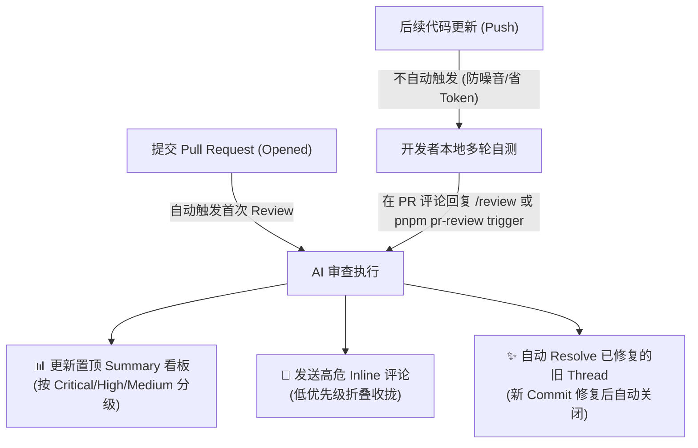
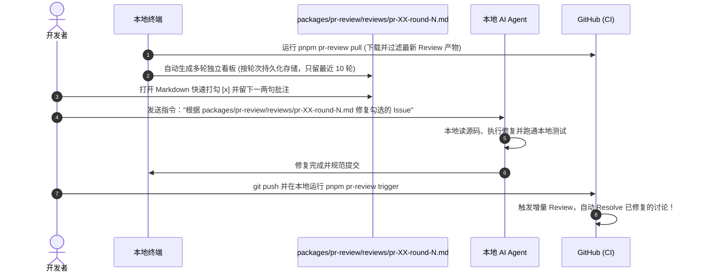

# @app/pr-review

> PR 生命周期管理与 OpenCodeReview (OCR) 自动化看差距套件。

本包将项目的 Pull Request 生命周期（开 PR、状态查询、安全合并）与 AI Code Review 闭环流程完整收敛，所有 Review 产物与轮次看板均保存在本包的 `reviews/` 目录下（并内置最近 10 轮保留与自动清理机制）。

---

## 🚀 统一命令速查

在项目根目录可通过 `pnpm pr-review <command>` 调用：

| 指令 | 简写 | 详细说明 |
| :--- | :--- | :--- |
| `pnpm pr-review pull` | - | 拉取最新 CI 产物并在 `reviews/` 下生成 `pr-<PR>-round-<N>.md` 看板，自动清理超过 10 轮的旧看板 |
| `pnpm pr-review trigger` | `review` | 在当前 PR 讨论区自动发表 `/review` 评论，触发 OpenCodeReview 增量扫描 |
| `pnpm pr-review create` | `pr` | 运行前置检查，推送特性分支并基于 PR 模板自动创建 Pull Request |
| `pnpm pr-review status` | - | 查看当前仓库 PR 与所有 checks 状态 |
| `pnpm pr-review merge` | - | 轮询等待分支保护门禁全绿，确认后执行 squash 合并并清理远端分支 |

---

## 🎯 1. 核心机制概览

本仓库接入了基于大语言模型的代码审查工具 `alibaba/open-code-review`，并进行了深度定制优化：



### 1.1 真增量审查 (`checkpoint_range: true`)
- **初次开 PR**：从 `merge-base` 到最新 commit 进行全量审查。
- **后续复查**：Bot 在置顶看板中记录上次审查的 commit 检查点。后续审查**仅对 `<checkpoint>..<new head>` 之间的纯增量提交进行扫描**，避免重复审查旧代码。
- **不重复评论 (`incremental: true`)**：即使增量范围有交集，相同代码行也不会重复发送雷同评论。

### 1.2 置顶动态看板 (`sticky_summary: true`)
- Bot 首次运行会在 PR 讨论区发布一条带有隐式签名（`<!-- ocr-summary -->`）的看板。
- 后续轮次的审查结果将通过 GitHub API **直接原地更新（PATCH）这一条看板**，避免反复发布主评论造成 PR 刷屏。

### 1.3 噪声治理与折叠 (`route_severity_below: low`)
- **高危问题（Critical / High / Medium）**：直接在代码差异行内生成 Inline Comment，便于就地查阅。
- **次要建议（Low / Style / Lint）**：自动收拢至置顶 Summary 看板的折叠区域 `<details>` 中，行内评论噪点减少 70% 以上。

### 1.4 自动关闭过时评论 (`resolve_outdated: true`)
- 当你在后续 commit 中修改了原来报错的代码行后，GitHub 会自动将其标记为 `isOutdated`。
- Bot 在下一轮审查确认该位置没有再次报错后，会自动调用 GraphQL API 将该 Review Thread 标记为 **Resolved**。

---

## 🤖 2. 与 AI Agent 协同修复的最佳实践

推荐采用**“本地一键拉取高优看板 ➔ 勾选/批注裁决 ➔ AI Agent 闭环修复”**的极简链路：



### 协同步骤：
1. **本地一键拉取最新轮次看板**：
   ```bash
   pnpm pr-review pull
   ```
   - 自动匹配当前分支关联 PR 的最新已完成 CI 产物；
   - 产物输出至 `packages/pr-review/reviews/pr-<PR编号>-round-<轮次>.md`；
   - 自动触发清理机制：整目录只保留最近 10 轮看板，多余历史看板自动剔除；
   - 智能比对上一轮状态，展示 `✨ 上一轮已成功解决` 清单，继承历史人工批注。
   - 高中危默认勾选采纳（`- [x]`），低优常规建议完整保留但默认忽略（`- [ ]`，支持手动打勾修复）。

2. **快速裁决与人工批注**：
   - 打开对应轮次的 markdown 看板；
   - 高危 / 中危保持默认采纳；如有预期设计或需忽略，取消勾选或在批注说明；
   - 低优建议按需勾选；
   - 批注要求直接在 `人工批注 / 修改要求` 输入自然语言。

3. **委托 AI Agent 闭环修复**：
   - 发送指令：
     > “请根据 `packages/pr-review/reviews/pr-<PR编号>-round-<轮次>.md` 执行代码修复：对标记修复的项执行修复，勾选忽略或留有批注的遵照批注处置，完成后运行本地测试。”

4. **一键提交并触发增量复查**：
   ```bash
   # 规范提交并推送到远端特性分支
   git push origin <branch>

   # 本地一键向 PR 发送 /review 请求（免开浏览器网页）
   pnpm pr-review trigger
   ```
